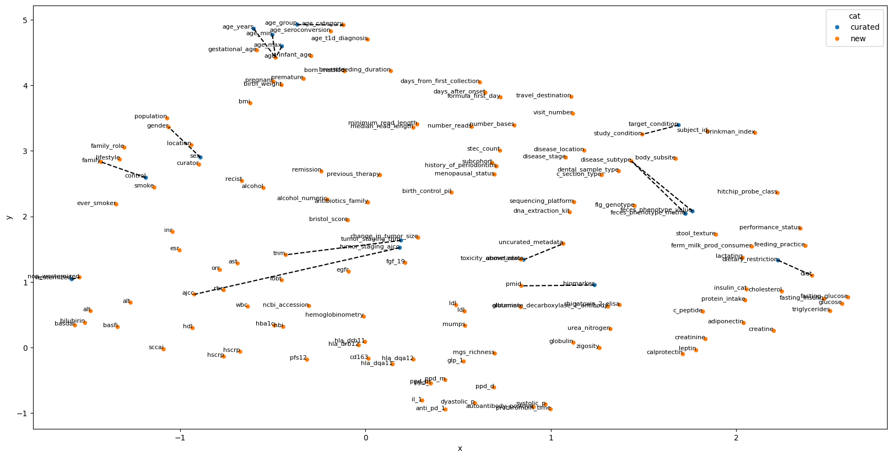
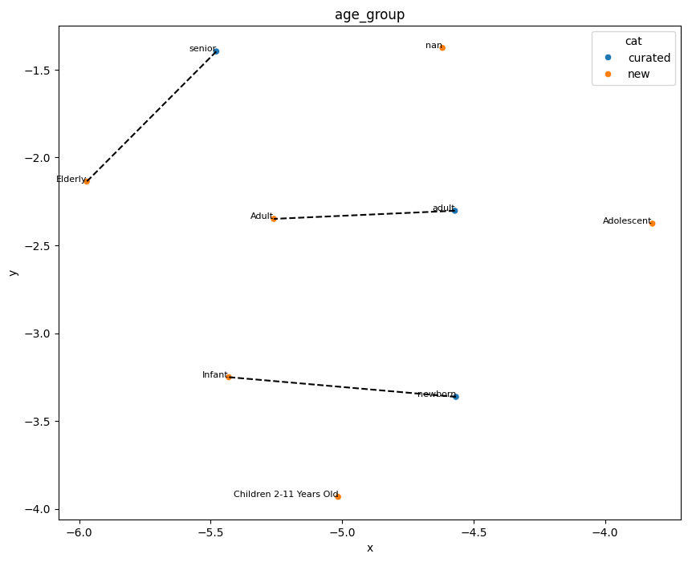

## Exploratory Data Analysis for metadata harmonization task of GSoC 2025

### About

This repository stores information for my EDA on the data provided for the "metadata harmonization" project from cBioPortal in GSoC 2025. My main objective for the EDA was to try out some ideas on the data to test them in practice, and to have some basic result at the end, in the form of a combined metadata composed of the original, curated metadata and the morphed form of new metadata.

### Repo Structure

I have divided my strategy in 4 main steps. They have their own folders in the repo and are named starting with numbers, in order of which they should be run. Information about other contents of the repo are as follows:
- `1_exploring_columns` contains the notebook where I have explored the columns of the two metadata files, and generated report using ydata_profiling to visually assess the data in them.
- `2_mapping_columns` has the code of the actual mapping between columns and corresponding figures.
- `3_merging_the_two_metadatas` has the code for morphing the new metadata appropriately to be able to merge with the curated metadata.
- `4_generating_report_of_comparison` has the code for generating ydata_profiling report comparing the data in curated metadata before and after the addition of new metadata. I wanted to reach this endpoint during my EDA, to have something substantial and learn as much as I could about the data and its intricacies in a short time.
- `data` folder contains both, the input data and also the single, output csv file which was obtained after all the processing. 
- `images` folder contains relevant images to show the result effectively to a viewer. 
- `legacy_files` folder is just for my own reference, and contains old files. 
- `utils` folder has modules storing useful functions.

### Approach

My approach revolves around one main idea: 

***First find matching columns between curated and new metadata, and then find the appropriate modifications on the entries of the new metadata for each column to fit the existing values of the curated metadata best.***

It involves applying a similar procedure twice, first on the columns, and then on the values for each mapped column pair. The procedure is as follows:

- Using a sentence transformer, find the cosine distance between each pair of sentences (sentence could be a column name or name of a category in a column). Then for each sentence belonging to the curated metadata, find the closest sentence from the new metadata. 
- Visualize the embeddings of all sentences in 2d using UMAP, with lines showing which pairs are mapped. Eg-

<!--  -->
- Make manual modifications if needed on the mapping.

### Details of Approach

Above is the gist of my approach. However, there are multiple details which I feel will be useful for our use case, but they require more thought and robustness against corner cases in the future. They are:

- We first check if there are some columns whose names are exactly the same in curated and new metadata. If yes, we remove them from the embedding computation. There surely can be exceptions, but atleast in this EDA, I have made the assumption that such columns can be directly matched.

- Assuming our curated metadata columns will remain decently constant, we can make use of that. 
    - We see many ontology-term columns, whose information can be derived from already mapped columns, so we ignore the ontology term columns initially, and then later on map the values from the mapped columns. 

- Whenver we do sentence similarity finding, cases when there is negation in one of the sentences need to be carefully dealt with, because they score high in similarity. In our case, this happened with the column named 'westernized' in curated and 'non_westernized' in new metadata, and I countered it with reversing the data values ('no' to 'yes' and 'yes' to 'no'). However, in general, I think there should be some check on cases when a high score is accompanies by negation (which can be measured by similarity to sentences like: 'no').

- In general, I found the UMAP approach to be quite useful in verifying the mappings found and possibly finding better ones, because we can find the possibly better mappings nearby the point mapped, and can take a closer look at only those we feel are worth looking at. This is applicable in both levels of applying sentence matching and hence is quite powerful I feel.

### Future Work

There is a lot of work required to make this approach work as best as possible for our use case. Some of them are listed below:

- I havent currently taken into account the datatype while matching columns algorithmically. This can possibly help us reach the best mapping faster.
- Also the while mapping columns, we should ideally take into account a part of the contents of the column. This may act as a proxy for datatype as well as the format in which the data is stored, helping us map the columns better. For this, I believe, thought is required on how to structure the data from the column and the column name to best allow the transformer to make sense of it, and find correct column matching.
- The biomarker column is a big task in itself. In the curated data, it is just one column storing information of various biomarkers of individuals. However, in the new data, there are multiple columns containing that information. One subpart of the whole pipeline in the future should be identifying biomarker columns (possibly here we can benefit from more biology-context models instead of the more general: "all-MiniLM-L6-v2"), and concatenating them appropriately to get the information in one column. 

### References

- Original Problem Statement: https://github.com/cBioPortal/GSoC/issues/124
- SentenceTransformers: https://sbert.net/ 
- ydata_profiling: https://github.com/ydataai/ydata-profiling
- Comparison between dataframes using ydata_profiling: https://pub.towardsai.net/how-to-compare-2-dataset-with-pandas-profiling-2ae3a9d7695e